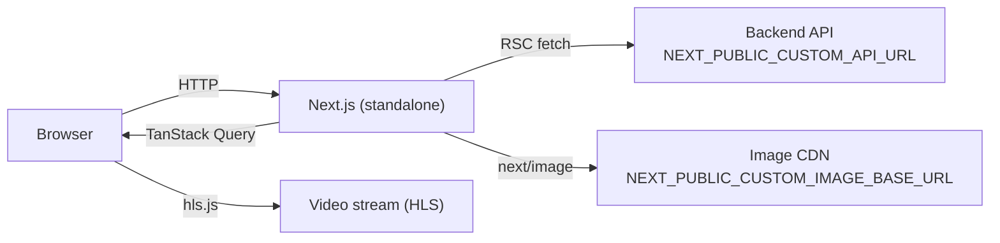

# EnternFlix

Production-grade Next.js 16 streaming UI template. Server-rendered, accessibility-aware, Docker-ready, and wired to a generic content API so you can swap in any backend without rewriting the frontend.

> Backend reference implementation: [bi8s-go](https://github.com/xanderbilla/bi8s-go) (Go). EnternFlix is the frontend half.

## Tech Stack

| Layer         | Choice                                      |
| ------------- | ------------------------------------------- |
| Framework     | Next.js 16 (App Router, RSC, Turbopack)     |
| Language      | TypeScript 5 (strict)                       |
| UI            | React 19, Tailwind CSS 3                    |
| Server state  | TanStack Query 5                            |
| HTTP client   | Axios (centralized instance + interceptors) |
| Media         | hls.js for adaptive streaming               |
| Icons         | lucide-react, react-icons                   |
| Testing       | Vitest, Testing Library, jsdom, fast-check  |
| Lint / format | ESLint (Next + a11y rules), Prettier        |
| Build target  | `output: "standalone"` (Node runtime)       |
| Container     | Multi-stage Dockerfile, docker-compose      |

## Architecture at a Glance



See [docs/ARCHITECTURE.md](docs/ARCHITECTURE.md) for full diagrams.

## Quick Start

```bash
# 1. Install
npm install

# 2. Configure env (required)
cp .env.example .env.local
# edit NEXT_PUBLIC_CUSTOM_API_URL and NEXT_PUBLIC_CUSTOM_IMAGE_BASE_URL

# 3. Run
npm run dev
```

App runs at `http://localhost:3000`. App routes redirect `/` → `/browse`.

## Scripts

| Command                  | Purpose                                  |
| ------------------------ | ---------------------------------------- |
| `npm run dev`            | Dev server (Turbopack, HMR)              |
| `npm run build`          | Production build (standalone output)     |
| `npm start`              | Run built standalone server              |
| `npm run lint`           | ESLint                                   |
| `npm run lint:fix`       | ESLint with autofix                      |
| `npm run typecheck`      | `tsc --noEmit`                           |
| `npm run format`         | Prettier write                           |
| `npm run format:check`   | Prettier check                           |
| `npm run test`           | Vitest single run                        |
| `npm run test:watch`     | Vitest watch                             |
| `npm run test:coverage`  | Coverage report (`coverage/`)            |
| `npm run audit:ci`       | Production dependency audit              |
| `npm run ci`             | Lint + format + typecheck + test + build |
| `npm run analyze`        | Build with `@next/bundle-analyzer`       |
| `npm run a11y:checklist` | Print accessibility QA checklist         |
| `npm run docker:build`   | Build container image                    |
| `npm run docker:up`      | Start via docker-compose                 |
| `npm run docker:down`    | Stop docker-compose                      |
| `npm run docker:logs`    | Tail container logs                      |

## Environment

Two variables are required; everything else has safe defaults. Full table in [docs/CONFIGURATION.md](docs/CONFIGURATION.md).

| Variable                            | Required | Purpose                      |
| ----------------------------------- | -------- | ---------------------------- |
| `NEXT_PUBLIC_CUSTOM_API_URL`        | Yes      | Backend base URL             |
| `NEXT_PUBLIC_CUSTOM_IMAGE_BASE_URL` | Yes      | Image CDN origin             |
| `NEXT_PUBLIC_SITE_URL`              | No       | Canonical site URL for SEO   |
| `NEXT_PUBLIC_HTTP_TIMEOUT_MS`       | No       | Axios per-request timeout    |
| `NEXT_PUBLIC_ENABLE_LOGGING`        | No       | Toggle client logger         |
| `NEXT_PUBLIC_IMAGE_HOSTS`           | No       | Extra hosts for `next/image` |

Server-side validation (`src/lib/env/env.ts`) fails fast on missing required values.

## Project Layout (Top Level)

```
src/
  app/         App Router routes, layouts, sitemap, robots
  components/  Feature components (Banner, MovieCard, Dialogs, ...)
  config/      site.ts (brand + SEO defaults)
  constants/   App-wide constants and icon maps
  contexts/    Video and Transition providers
  hooks/       api/, ui/, video/ — typed hooks per concern
  lib/         api/, env/, logger/, query/, seo/
  services/    Server-callable data fetchers
  types/       Shared TypeScript types
  utils/       Pure helpers (validation, errors, video, etc.)
```

Full hierarchy and placement rules: [docs/FOLDER_STRUCTURE.md](docs/FOLDER_STRUCTURE.md).

## Documentation

| Doc                                             | Purpose                                                 |
| ----------------------------------------------- | ------------------------------------------------------- |
| [INDEX.md](docs/INDEX.md)                       | Reading order and doc map                               |
| [ARCHITECTURE.md](docs/ARCHITECTURE.md)         | App Router strategy, RSC vs Client, data flow           |
| [FOLDER_STRUCTURE.md](docs/FOLDER_STRUCTURE.md) | Where every file goes                                   |
| [API.md](docs/API.md)                           | Endpoints, services, hooks, request/response shapes     |
| [CONFIGURATION.md](docs/CONFIGURATION.md)       | Environment variables                                   |
| [SEO.md](docs/SEO.md)                           | Metadata, JSON-LD, sitemap, robots                      |
| [SECURITY.md](docs/SECURITY.md)                 | Headers, CSP, XSS posture, dependency policy            |
| [AUTHENTICATION.md](docs/AUTHENTICATION.md)     | Current state and integration plan                      |
| [STATE_MANAGEMENT.md](docs/STATE_MANAGEMENT.md) | Server vs UI state, query/cache rules                   |
| [PERFORMANCE.md](docs/PERFORMANCE.md)           | RSC, images, fonts, bundles, caching                    |
| [TESTING.md](docs/TESTING.md)                   | Vitest setup, what to test, what to skip                |
| [ACCESSIBILITY.md](docs/ACCESSIBILITY.md)       | Semantics, ARIA, keyboard, focus                        |
| [DEPLOYMENT.md](docs/DEPLOYMENT.md)             | Build, run, Docker, troubleshooting                     |
| [CI_CD.md](docs/CI_CD.md)                       | GitHub Actions pipeline, AWS ECR, multi-platform Docker |
| [TEMPLATE_GUIDE.md](docs/TEMPLATE_GUIDE.md)     | Rebrand and adapt this template                         |

## Using This as a Template

EnternFlix is structured so you can fork it, swap brand and API, and ship. See [docs/TEMPLATE_GUIDE.md](docs/TEMPLATE_GUIDE.md) for a step-by-step walkthrough (logo, footer, metadata, theme, content sources).

## Contributing

See [CONTRIBUTING.md](CONTRIBUTING.md). Before opening a PR:

```bash
npm run lint && npm run typecheck && npm run test && npm run build
```

## Author

Vikas Singh — [xanderbilla.com](https://xanderbilla.com)

## License

MIT.
