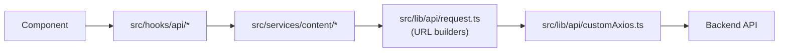

# API

EnternFlix talks to a single backend identified by `NEXT_PUBLIC_CUSTOM_API_URL`. All requests go through one Axios instance, all endpoints have a typed service wrapper, and most reads are exposed via TanStack Query hooks.

## Layers



Server components may call services directly (no hook layer).

## Axios Instance

`src/lib/api/customAxios.ts`:

```ts
axios.create({
  baseURL: config.customApi.baseUrl, // NEXT_PUBLIC_CUSTOM_API_URL
  timeout: config.http.timeoutMs, // NEXT_PUBLIC_HTTP_TIMEOUT_MS, default 10000
  headers: { "Content-Type": "application/json" },
});
```

Interceptors (`src/lib/api/axiosInterceptors.ts`):

| Stage    | Behavior                                                           |
| -------- | ------------------------------------------------------------------ |
| Request  | Logs request setup failures via `logger.error`                     |
| Response | 5xx → `logger.error`, 401/403 → `logger.warn`, 429 → `logger.warn` |

There is no built-in retry; retries live at the React Query layer (`src/lib/query/retryPolicy.ts`).

## URL Builders

`src/lib/api/request.ts` exposes path/query encoders to prevent injection of `/`, `?`, `#`, spaces, and other reserved chars:

| Helper        | Purpose                                       |
| ------------- | --------------------------------------------- |
| `encPath(s)`  | `encodeURIComponent` for a path segment       |
| `encQuery(s)` | Query value encoder (substitutes `%20` → `+`) |

All endpoint constructors below run through these.

## Endpoints

| Function                                         | Method | Path                                           | Notes                              |
| ------------------------------------------------ | ------ | ---------------------------------------------- | ---------------------------------- |
| `fetchAllContent(type)`                          | GET    | `c/content?type={type}`                        |                                    |
| `fetchMovieById(id)`                             | GET    | `c/content/{id}`                               | Used by `useTitle`, watch metadata |
| `fetchPersonById(id)`                            | GET    | `c/people/{id}`                                |                                    |
| `fetchPersonMovies(id, type)`                    | GET    | `c/people/{id}/content?type={type}`            |                                    |
| `fetchAttributes(type = "genres")`               | GET    | `c/attributes?type={type}`                     |                                    |
| `fetchDiscoverByAttribute(attributeId, content)` | GET    | `c/attributes/{attributeId}?content={content}` |                                    |
| `fetchDiscover(type, content)`                   | GET    | `c/discover?type={type}&content={content}`     | Supports cursor + sort             |
| `fetchBanner(type)`                              | GET    | `c/banner?type={type}`                         |                                    |
| `fetchSearch(query, options)`                    | GET    | `c/search?query={q}&in={in}&sort={s}&page={p}` | `in`: all/movie/tv/people          |
| `fetchPlayback(contentType, contentId)`          | GET    | `c/play/{contentType}/{contentId}`             | Returns HLS URL + tracks           |

Refer to `src/lib/api/request.ts` for exact param signatures.

## Response Envelope

```ts
type ApiResponse<T> = {
  success: boolean;
  data: T;
  message?: string;
};

type PaginatedResponse<T> = ApiResponse<{
  items: T[];
  cursor?: string;
  hasMore?: boolean;
}>;
```

Errors come back as `ApiErrorEnvelope` with `success: false` and a normalized `error` field. Client code should consume errors via `src/utils/errorHelpers.ts` (`getUserFriendlyErrorMessage`, `isNetworkError`).

## Services

`src/services/content/`:

| Function                                      | Purpose                                                                          |
| --------------------------------------------- | -------------------------------------------------------------------------------- |
| `fetchTitleData(id): Promise<TitleData>`      | Fetch a single title; returns `{ content, mediaType }`. Safe in RSC + client.    |
| `fetchFreshExploreMovies(hookName, fallback)` | Map a hook name to discover params, fetch fresh items, return fallback on error. |
| `getDiscoverNavigation()`                     | Build navigation entries for discover landing surfaces.                          |

Services may be called from server components directly. They never own caching; that is the hook's responsibility.

## React Query Hooks

`src/hooks/api/`. Defaults from `QueryProvider`: `staleTime` 15m, `gcTime` 1h, `refetchOnWindowFocus: false`, `refetchOnReconnect: true`.

| Hook                                           | Query Key                                | Service / Endpoint                          | Enabled when             |
| ---------------------------------------------- | ---------------------------------------- | ------------------------------------------- | ------------------------ |
| `useCustomContent(type)`                       | `["custom","content",type]`              | `fetchDiscover("recent", type)`             | always                   |
| `useCustomMovies()`                            | `["custom","content","movie"]`           | `fetchDiscover("recent","movie")`           | always                   |
| `useCustomMovie(id, enabled?)`                 | `["custom","movie",id]`                  | `fetchMovieById(id)`                        | `enabled && !!id`        |
| `useTrending()`                                | `["trending"]`                           | `fetchDiscover("trending","all")`           | always                   |
| `useSearch(query, scope, sort)`                | `["search",query,scope,sort]`            | `fetchSearch(query, …)` (infinite)          | `query.length > 2`       |
| `useRandomContent()`                           | `["random","content"]`                   | `fetchDiscover("recent","all")` then sample | always                   |
| `useBanner(type)`                              | `["banner",type]`                        | `fetchBanner(type)`                         | always                   |
| `useDiscoverByAttribute(id, content, en)`      | `["discover","attribute",id,content]`    | `fetchDiscoverByAttribute(id, content)`     | `enabled && !!id`        |
| `useInfiniteDiscover(type, content, en, sort)` | `["discoverInfinite",type,content,sort]` | `fetchDiscover(...)` (infinite, cursor)     | `enabled`                |
| `useGenresAttributes(contentType)`             | `["attributes","genres",contentType]`    | `fetchAttributes("genres")`                 | always                   |
| `useTitle(id, enabled?)`                       | `["title",id]`                           | `fetchTitleData(id)`                        | `!!id && enabled`        |
| `usePerson(id, enabled?)`                      | `["person",id]`                          | `fetchPersonById(id)`                       | `!!id && enabled`        |
| `usePersonMovies(id, type, enabled?)`          | `["personMovies",id,type]`               | `fetchPersonMovies(id, type)`               | `!!id && enabled`        |
| `usePlayback(contentType, contentId, en?)`     | `["playback",contentType,contentId]`     | `fetchPlayback(contentType, contentId)`     | `!!contentId && enabled` |

Single-resource hooks (`useTitle`, `usePerson`, `usePersonMovies`, `usePlayback`) override defaults to `staleTime` 5m / `gcTime` 10m and `retry: 2`.

## Retry Policy

`src/lib/query/retryPolicy.ts`:

- 4xx (except 408 / 429) → no retry.
- 408 / 429 / 5xx / network / timeout → up to 2 retries with exponential backoff.
- Mutations are not used in the current app.

## Adding a New Endpoint

1. Add a builder in `src/lib/api/request.ts` using `encPath`/`encQuery`.
2. Add a service function in `src/services/content/` (or new subfolder) that uses the builder + `customAxios`.
3. Add a React Query hook in `src/hooks/api/` with a stable query key.
4. Add a return type in `src/types/`.
5. Add a test for the service and the hook (`*.test.ts`).
