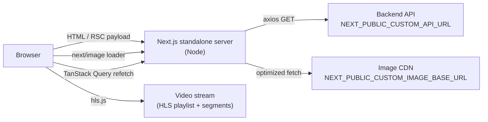
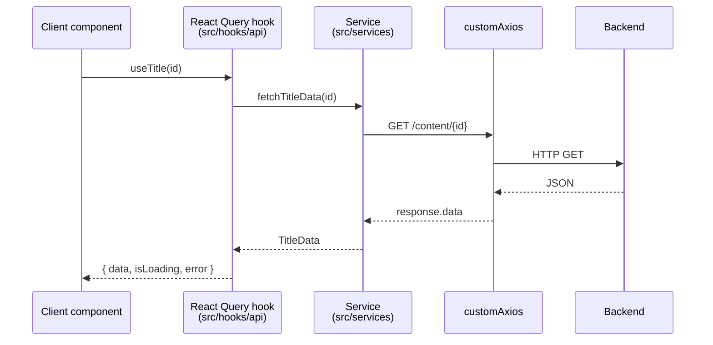
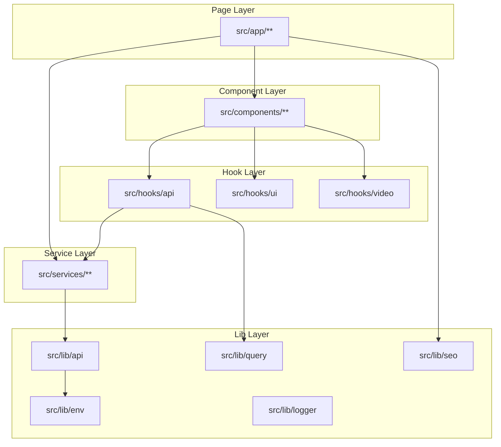

# Architecture

EnternFlix is a Next.js 16 App Router application that renders the shell on the server, hydrates interactive surfaces on the client, and fetches all content from a single backend API through a centralized Axios instance.

## High-Level Topology



- The Next.js server handles RSC rendering, image optimization, metadata, sitemap, and robots.
- The browser owns playback (hls.js), interactive UI (dialogs, navbar, search), and client cache via TanStack Query.
- The backend API is consumed identically from server components and client hooks via shared services in `src/services/`.

## Rendering Strategy

| Layer                     | Type                    | Notes                                                          |
| ------------------------- | ----------------------- | -------------------------------------------------------------- |
| Root layout               | Server                  | Wraps `QueryProvider` + `VideoProvider` + `TransitionProvider` |
| Page entries              | Server                  | Use `generateMetadata`, may pre-fetch via services             |
| Feature components        | Client (`"use client"`) | Anything with hooks, hls.js, dialogs, hover state              |
| Shared primitives (`UI/`) | Mixed                   | Most are client (`RemoteImage`, `BaseDialog`)                  |
| `error.tsx`               | Client                  | Required by App Router                                         |
| `loading.tsx`             | Server                  | Streaming fallback                                             |
| `not-found.tsx`           | Server                  | Reuses `NotFoundContent`                                       |

There is no static export. Pages are rendered per request; caching lives in TanStack Query and HTTP-layer image caching.

## Routes

```
src/app/
├── layout.tsx              providers + global metadata
├── page.tsx                308 → /browse
├── loading.tsx             root streaming fallback
├── error.tsx               global error boundary
├── not-found.tsx           404 page
├── robots.ts               robots.txt generator
├── sitemap.ts              sitemap.xml generator
└── (pages)/
    ├── browse/
    │   ├── page.tsx
    │   ├── recent/         curated lists
    │   ├── latest/
    │   ├── popular/
    │   ├── trending/
    │   ├── movies/
    │   ├── tv-shows/
    │   └── genre/[id]/     dynamic genre filter
    ├── search/page.tsx     query param `?q=`
    └── watch/page.tsx      query params `?id=&type=`
```

The `(pages)` group exists to share a layout without affecting URLs. `/watch` and `/search` use query params, not dynamic segments, because their content is non-canonical and excluded from the sitemap.

## Data Flow



- Hooks define query keys and cache policy.
- Services wrap a single endpoint and return typed data.
- `customAxios` enforces base URL, timeout, headers, and interceptors.
- Server components call services directly (no React Query).

See [API.md](API.md) for the full endpoint and hook catalog.

## Providers

`src/app/layout.tsx` composes:

```
QueryProvider
└── VideoProvider           // pause-banner reference counting
    └── TransitionProvider  // 500ms fade across route changes
        └── {children}
```

| Provider             | File                                 | Exposes                                    |
| -------------------- | ------------------------------------ | ------------------------------------------ |
| `QueryProvider`      | `src/lib/query/QueryProvider.tsx`    | TanStack Query client                      |
| `VideoProvider`      | `src/contexts/VideoContext.tsx`      | `pauseBanner` / `resumeBanner` ref-counted |
| `TransitionProvider` | `src/contexts/TransitionContext.tsx` | `navigateWithTransition(url)` with overlay |

## Layered Module Boundaries



Rules:

- Pages may call services directly (server) or use hooks (client).
- Hooks may call services and other hooks; never call `customAxios` directly.
- Services may call `customAxios` and helpers in `src/lib/api/request.ts`; nothing else.
- `lib/` is the only place that reads `process.env`.
- Components consume hooks, never services or axios.

## Error and Loading

| Surface             | Mechanism                                              |
| ------------------- | ------------------------------------------------------ |
| Route-level loading | `loading.tsx` (root + per-section)                     |
| Route-level error   | `error.tsx` at root, surfaces unhandled exceptions     |
| Component fallback  | `src/components/UI/ErrorBoundary.tsx`                  |
| API errors          | `src/lib/api/axiosInterceptors.ts` + `errorHelpers.ts` |
| 404                 | `src/app/not-found.tsx` + `NotFoundContent`            |

## SEO Surfaces

- `generateMetadata` on each page (built via `src/lib/seo/metadata.ts`).
- JSON-LD via `src/lib/seo/jsonLd.tsx` (`Movie`, `TVSeries`, `CollectionPage`).
- `src/app/robots.ts` and `src/app/sitemap.ts`.

Detail in [SEO.md](SEO.md).

## Build Output

`next.config.js` sets `output: "standalone"`. `npm run build` produces `.next/standalone/server.js` plus a minimal `node_modules`. Deploy that directory plus `.next/static/` and `public/`. See [DEPLOYMENT.md](DEPLOYMENT.md).
