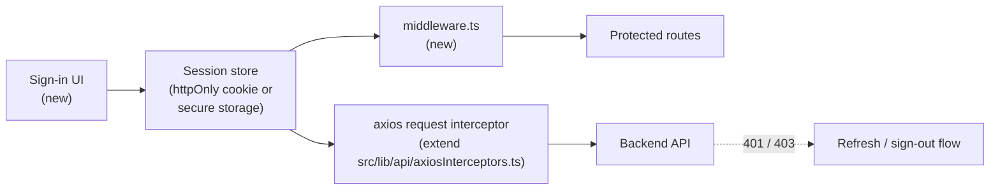

# Authentication

**Status: not implemented.** EnternFlix is currently a public, read-only catalog. Every backend call is anonymous. This document describes what exists, what is intentionally missing, and how to add auth without rewriting the data layer.

## Current State

| Concern               | Status                                                           |
| --------------------- | ---------------------------------------------------------------- |
| Sign in / sign up UI  | Not implemented                                                  |
| Session storage       | None (no cookies, no localStorage tokens)                        |
| Authorization headers | Not attached to outbound requests                                |
| Protected routes      | None — everything under `/browse`, `/search`, `/watch` is public |
| 401 / 403 handling    | Logged as warnings via `src/lib/api/axiosInterceptors.ts`        |
| Server middleware     | No `middleware.ts` file present                                  |

## Where Auth Will Plug In

The HTTP and route layers are already structured so an auth integration only touches a few files.



## Recommended Integration Plan

### 1. Choose a Session Mechanism

| Option                              | Pros                                         | Cons                                   |
| ----------------------------------- | -------------------------------------------- | -------------------------------------- |
| HttpOnly cookie (server-set)        | Safe from XSS, works with SSR/RSC            | Requires backend to set cookie         |
| Encrypted JWT in HttpOnly cookie    | Self-contained, easy to verify in middleware | Token rotation complexity              |
| Token in memory + refresh in cookie | Avoids localStorage XSS exposure             | Lost on full reload until refresh runs |

Avoid storing tokens in `localStorage` / `sessionStorage`. They are reachable from any script that bypasses CSP.

### 2. Attach Token to Requests

Extend `configureRequestInterceptor` in `src/lib/api/axiosInterceptors.ts`:

```ts
instance.interceptors.request.use((cfg) => {
  const token = readSessionToken(); // server: from cookies(); client: from a context
  if (token) cfg.headers.Authorization = `Bearer ${token}`;
  return cfg;
});
```

Server components and route handlers should resolve the token from cookies at request time; client hooks should read from a session context that is hydrated after sign-in.

### 3. Handle 401 / 403

Today, the response interceptor warns. Replace the warn with:

- 401: clear session, optionally call refresh endpoint, redirect to sign-in if refresh fails.
- 403: surface a "no access" error via `errorHelpers.ts`.

### 4. Protected Routes

Add `middleware.ts` at the project root:

```ts
export const config = { matcher: ["/account/:path*", "/library/:path*"] };
export default function middleware(req) {
  if (!req.cookies.get("session")) {
    return NextResponse.redirect(new URL("/sign-in", req.url));
  }
}
```

Public routes (`/browse`, `/search`, `/watch`) stay unmatched.

### 5. UI

Add `Sign in` / `Sign out` controls in `src/components/Navbar/`. Reuse `BaseDialog` for any modal flows.

### 6. Tests

- Unit-test the request/response interceptor with a fake token in axios mocks.
- Add a middleware integration test once routes are protected.

## Security Notes

- Never inline tokens behind `NEXT_PUBLIC_*` (it would ship them to the bundle).
- Cookies must be `Secure`, `HttpOnly`, `SameSite=Lax` (or `Strict` for sensitive flows).
- Rotate refresh tokens server-side; treat them as bearer credentials.
- Re-evaluate CSP `connect-src` if the auth provider introduces new origins.

## Related Docs

- [SECURITY.md](SECURITY.md) — headers and CSP, including which directives need updates when an auth provider is added.
- [API.md](API.md) — where the request interceptor lives.
